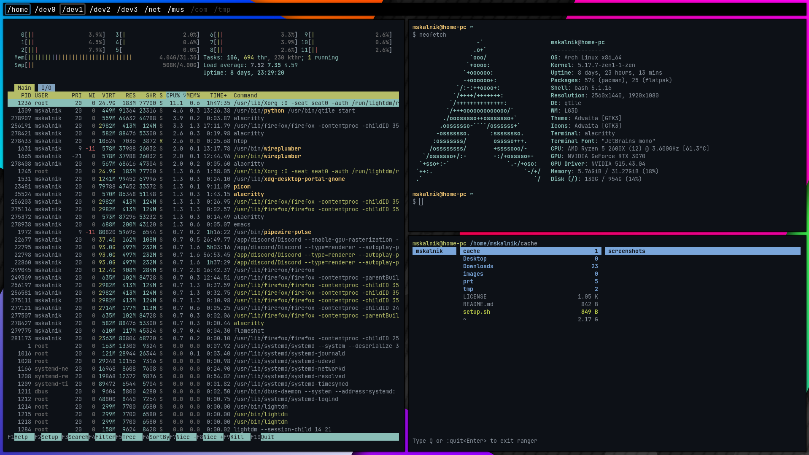
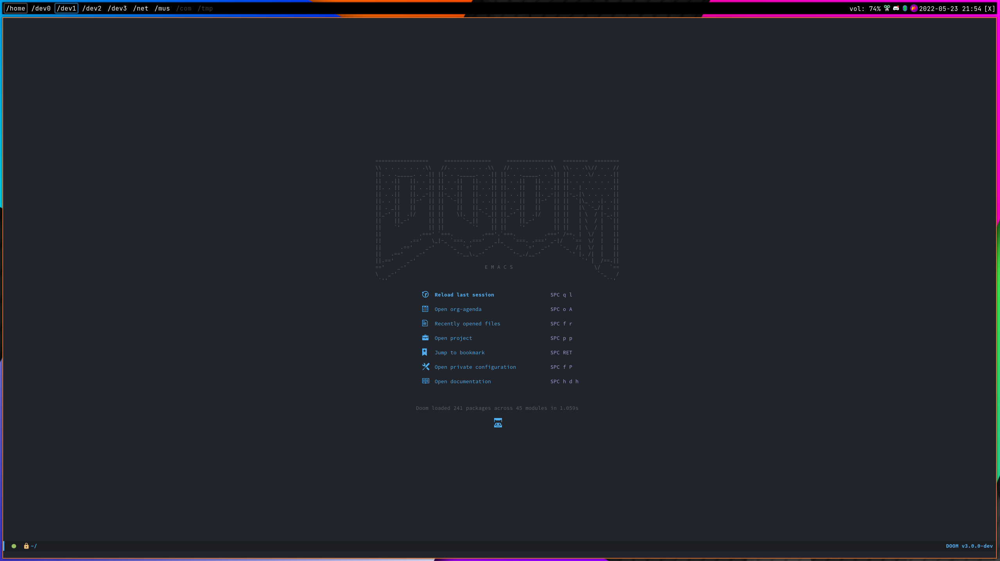

# Dotfiles

## Screenshot

Screen 1:



Screen 2:



## Installation

Install and configure `git`. After that go to the home folder and clone the
project:

`git clone --bare git@github.com:mskalnik/dotfiles.git $HOME/.dotfiles`

Run `setup.sh`:

`chmod +x setup.sh && ./setup.sh`

## Software information

| Type                 | Name                                                  |
|----------------------|-------------------------------------------------------|
| Operating System     | [Ubuntu](https://ubuntu.com/)                         |
| Desktop Environment  | [Gnome](https://www.gnome.org/)                       |
| Terminal Emulator    | [Alacritty](https://alacritty.org/)                   |
| Application Launcher | [Rofi](https://github.com/davatorium/rofi)            |
| Text Editor          | [Doom Emacs](https://github.com/doomemacs/doomemacs)  |

## Testing

To test the config install [Xephyr](https://wiki.archlinux.org/title/Xephyr) and
run:

```
Xephyr -br -ac -noreset -screen 1280x720 :1 &
DISPLAY=:1 /usr/bin/qtile start
```
